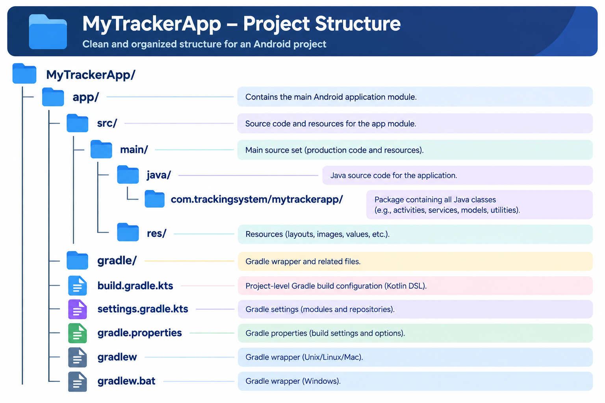

<h1>MyTrackerApp</h1>

<h3>A real-time Android vehicle tracking system built with Java, Firebase, Google Maps, QR-based vehicle connectivity, and foreground location tracking.</h3>

<h2>Features</h2>
📱 Phone number authentication with Firebase OTP  
👤 Admin and User role management  
🚗 Vehicle connection using QR code  
📷 Admin generates a vehicle QR code  
🔗 User scans QR code to connect with an Admin  
📍 Real-time user location tracking using Google Maps  
🔄 Real-time location synchronization using Firebase Realtime Database  
🛰️ Foreground location tracking service  
⏱️ Location updates every 5 seconds while tracking  
🗺️ Admin dashboard with live user markers and location details  
🔐 Session management using Firebase Authentication and SharedPreferences  
🔁 Automatic screen/session restoration using LastScreenManager  
💾 Firebase offline persistence  
🛑 Start/Stop location tracking  
🚪 Secure logout and session cleanup  
👤 User profile management with name, phone number, vehicle number, and role  

<h3>The QR connection flow stores the user and vehicle relationship in Firebase and changes the connection status to connected.</h3>

<h2>Technologies Used</h2>
Java  
Android Studio  
Firebase Authentication  
Firebase Realtime Database  
Google Maps SDK  
Google Fused Location Provider  
ZXing / JourneyApps Barcode Scanner  
SharedPreferences  
Android Foreground Service  
XML Layouts  
Gradle  

<h2>Application Flow</h2>

<h2>Location Tracking</h2>

The application uses Android's Foreground Service with the Fused Location Provider to obtain high-accuracy location updates. The user's latitude and longitude are continuously synchronized with Firebase Realtime Database, allowing the Admin Dashboard to display the user's live location on Google Maps.

<h2>Session Management</h2>

The application uses Firebase Authentication and SharedPreferences to maintain login and vehicle-session information. LastScreenManager stores and restores the previously active screen, helping the application continue from the appropriate screen after reopening.

<h2>Firebase Data</h2>

<h3>The application uses Firebase Realtime Database for:</h3>

User profiles  
Admin/User connection information   
Vehicle IDs  
User IDs   
Connection status   
Live latitude and longitude   

<h3>Firebase offline persistence is also enabled through the application class.</h3>

<h2>Project Structure</h2>

<h3>Project Output</h3>

[📄 View Project Output](docs/Project-Output.pdf)

<h3>Author</h3>
Archana  
BCA Student | Java Developer | Android Development 

GitHub: Archana-v36
